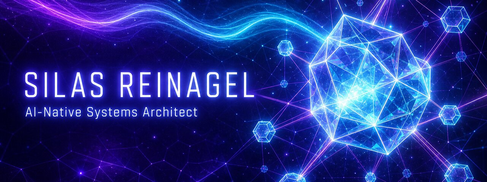

## Designing agentic AI systems for the enterprise.

I architect AI-native systems — memory substrates, autonomous agents, secure tooling, and the human-facing layer that makes them trustworthy.

### Building now

- **[agentmem](https://github.com/SilasReinagel/agentmem)** — CLI memory infrastructure for AI agents. SQLite + FTS5. Tiered events, entities, lessons, principles.
- **[pr-shepherd](https://github.com/SilasReinagel/pr-shepherd)** — AI agent that auto-fixes CI failures on your PRs. Watches, diagnoses, fixes, pushes — until green.
- **[AiProductEngineerQuestions](https://github.com/SilasReinagel/AiProductEngineerQuestions)** — 500+ curated questions defining the AI Product Engineering discipline. Entry-level through Staff/Principal.
- **[HoloAiBuddy](https://github.com/SilasReinagel/HoloAiBuddy)** — Cube display API + Cursor hooks for ambient AI presence.
